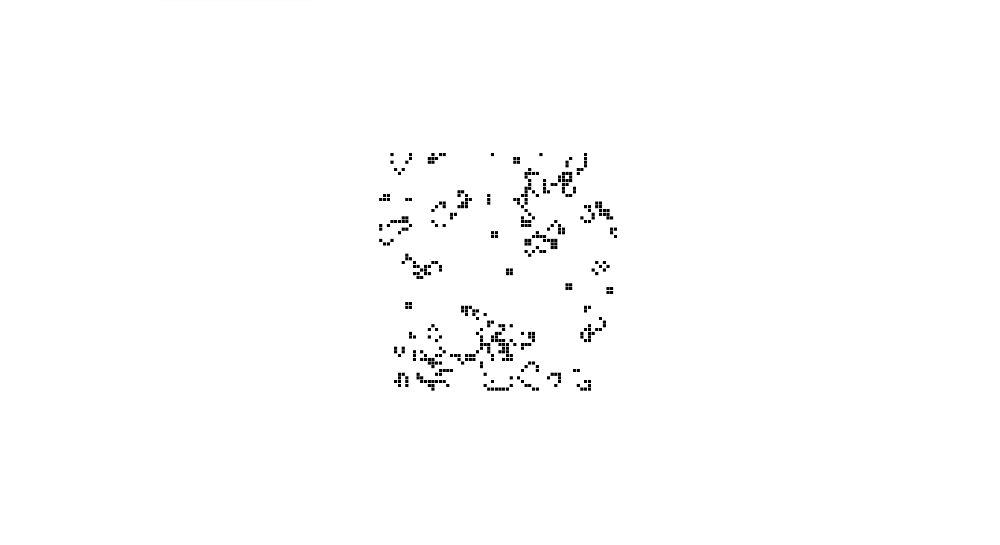

# Rust Projects

This repo is made of 5 projects:

1. [**Hello Cargo**](#hellocargo): A quick intro to Rust syntax.
2. [**Guessing Game**](#guessing): A hands-on introduction to the Rust language.
3. [**Minigrep**](#minigrep): A simple version of the classic command line tool grep.
4. [**Hello**](#hello): A multithreaded web server that says “hello”.
5. [**Game of Life**](#life): A zero-player game to learn how to use Rust, WebAssembly, and JavaScript together.

##  1) Hello Cargo

A quick intro to Rust syntax.

[See 01-hello-cargo folder](https://github.com/solygambas/rust-projects/tree/main/01-hello-cargo)

### Features

- installing Rustup, [Rust for Visual Studio Code](https://marketplace.visualstudio.com/items?itemName=rust-lang.rust) and [Even Better TOML](https://marketplace.visualstudio.com/items?itemName=tamasfe.even-better-toml).
- setting up a project with Cargo.
- printing and formatting strings.
- handling variables.
- discovering primitive types.
- playing with strings, tuples, arrays and vectors.
- rendering conditionals.
- using loops, functions and pointer references.
- creating custom data types with structs.
- defining enums.
- grabbing args from CLI.

Based on [Rust Crash Course](https://www.youtube.com/watch?v=zF34dRivLOw) by Brad Traversy (2019).

##  2) Guessing Game

A hands-on introduction to the Rust language.

[See 02-guessing-game folder](https://github.com/solygambas/rust-projects/tree/main/02-guessing-game)

### Features

- handling user input with the io library.
- adding rand from [crates.io](https://crates.io/) as a dependency.
- generating a secret number.
- comparing the guess to the secret number.
- allowing multiple guesses with looping.
- quitting after a correct guess.
- handling invalid input.

Based on [The Rust Programming Language](https://doc.rust-lang.org/book/) by Steve Klabnik and Carol Nichols (2021).

##  3) Minigrep

A simple version of the classic command line tool grep.

[See 03-minigrep folder](https://github.com/solygambas/rust-projects/tree/main/03-minigrep)

### Features

- accepting command line arguments.
- reading a file.
- refactoring to improve modularity and error handling.
- developing the library’s functionality with Test-Driven Development (TDD).
- working with environment variables.
- writing error messages to standard error instead of standard output.
- using closures and iterators.

Based on [The Rust Programming Language](https://doc.rust-lang.org/book/) by Steve Klabnik and Carol Nichols (2021).

##  4) Hello

A multithreaded web server that says “hello”.

[See 04-hello folder](https://github.com/solygambas/rust-projects/tree/main/04-hello)

### Features

- listening to the TCP connection and reading the request.
- writing a response and returning HTML.
- validating the request and selectively responding.
- simulating a slow request.
- improving throughput with a thread pool.
- handling graceful shutdown.

Based on [The Rust Programming Language](https://doc.rust-lang.org/book/) by Steve Klabnik and Carol Nichols (2021).

##  5) Game of Life

A zero-player game to learn how to use Rust, WebAssembly, and JavaScript together.

[See 05-game-of-life folder](https://github.com/solygambas/rust-projects/tree/main/05-game-of-life)

    

### Features

- cloning the project template and understanding the folder structure.
- building the project with wasm-pack.
- putting it into a web page with wasm-app.
- serving locally with webpack.
- implementing the Game of Life with Rust.
- rendering to canvas directly from memory with JavaScript.

Based on [The Rust and WebAssembly Book](https://rustwasm.github.io/docs/book/) by The Rust and WebAssembly Working Group (2021).
